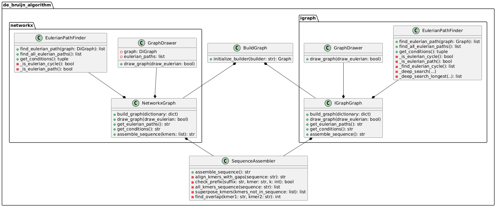

# Ensamblado a partir de fragmentos utilizando grafos de Bruijn y algoritmos de grafos

  
  ## 1. Creación de la definición del grafo
  
  Para dfinir el grafo de Bruijn, se utiliza el módulo `create`, que contiene la clase necesaria para este proceso. Esta clase, a partir de una lista de $k$-mers, genera un diccionario en el que las claves representan los prefijos de los $k-mers$ y los valores corresponden a los sufijos asociados. 
  
  ## 2. Implementación del algoritmo
  
  Para este propósito, se dispone de dos módulos con implementaciones distintas: uno basado en la biblioteca `NetworkX` y otro en la biblioteca `IGraph`. Cada módulo incluye una clase principal que gestiona todos los métodos de las clases, una clase dedicada al cálculo del ciclo o camino Euleriano y otra clase destinada a la visualización del grafo. La Figura 1 presenta un resumen general del paquete `de_bruijn_algorithm`, el cual se detallará en profundidad a continuación.
  
  

    
      
<strong>Figura 1.</strong> Diagrama de clases del algoritmo.
 
  

  ### 2.1. Paquete `networkx`

  Este paquete implementa toda la lógica necesaria para construir un grafo, calcular su ciclo o camino euleriano, y representarlo gráficamente mediante la librería `networkx` de Python. A continuación se detallan las tres clases principales que componen el paquete:
  - **`NetworkxGraph`**: Esta clase es responsable de construir el grafo, llamar a la clase encargada de su representación gráfica y ejecutar el cálculo del ciclo o camino euleriano. Además, es la interfaz principal para proporcionar los resultados o detalles al usuario final.
  - **`GraphDrawer`**: Esta clase se encarga de dibujar el grafo, mostrando o no el camino euleriano, según corresponda.
  - **`EulerianPathFinder`**: Esta clase es la responsable de verificar la existencia de un ciclo euleriano. Si no se cumple esta condición, verifica si existen las condiciones necesarias para un camino euleriano y, de ser posible, lo devuelve. En caso de que no exista un camino euleriano, devuelve el camino entre dos nodos especificados como inicio y fin, aunque este no sea euleriano. También muestra qué condiciones se cumplen o no para los distintos tipos de caminos.

  ### 2.2. Paquete `igraph`

  Este paquete implementa una lógica similar a la del paquete anterior, con la diferencia de que la biblioteca `igraph` no incluye algoritmos para calcular ciclos o caminos eulerianos; en su lugar, proporciona funcionalidad para calcular caminos entre dos nodos. Por lo tanto, las clases del paquete son similares a las del paquete `networkx`, con la particularidad de que la clase **`EulerianPathFinder`** implementa métodos para calcular manualmente los ciclos o caminos eulerianos, cuando estos existen.

  ## 3. Determinación de un Ciclo o Camino Euleriano

  Como bien ya se ha explicado previamente, en cada paquete se contiene una clase la cual es la encargada de realizar la búsqueda. A continuación se explicará únicamente la implementación del paquete `networkx` ya que es aquel más simple puesto que la librería proporciona algoritmos y funciones que lo facilitan:
  - `_is_eulerian_cycle()`: etermina si el grafo tiene un ciclo euleriano verificando que, para cada nodo, los grados de entrada y salida sean iguales y si el grafo es fuertemente conexo. Si no se cumplen estas condiciones, `cycle_conditions` explica por qué no existe un ciclo euleriano, y el método devuelve `False`.
  - `_is_eulerian_path()`: determina si el grafo tiene un camino euleriano. Para ello verificatres condiciones:
    1. La mayoría de nodos deben tener el mismo grado de entrada y salida.
    2. Debe haber exactamente un nodo con un grado de salida mayor en 1 (nodo de inicio).
    3. Debe haber exactamente un nodo con un grado de entrada mayor en 1 (nodo de fin).
    Si las condiciones no se cumplen, se proporciona una explicación en `path_conditions` sobre la falta de nodos válidos o grados no coincidentes. El método devuelve `False`.
  - `find_eulerian_path(graph)`: Este método busca un ciclo o camino euleriano en el grafo proporcionado.
    1. Intenta primero encontrar un ciclo euleriano llamando a `_is_eulerian_cycle`.
       - Si existe, usa `nx.eulerian_circuit` para obtener el ciclo y lo guarda en `self.eulerian_paths`.
    2. Si no existe un ciclo, intenta encontrar un camino euleriano llamando a `_is_eulerian_path`.
       - Si existe un camino, llama al método `find_all_eulerian_paths` para encontrar todos los caminos posibles y los almacena en `self.eulerian_paths`.
    3. Finalmente, devuelve `self.eulerian_paths` con los caminos o ciclos encontrados.
  - `find_all_eulerian_paths()`: Este método encuentra todos los posibles caminos eulerianos entre nodos válidos de inicio y fin.
    1. Identifica los nodos de inicio y fin posibles (aquellos que tienen un grado de entrada y salida desbalanceado).
  2. Si hay un solo par de nodos de inicio y fin, utiliza `nx.eulerian_path` para obtener el camino y lo agrega a `self.eulerian_paths`.
  3. Si hay múltiples pares de nodos de inicio y fin, genera combinaciones posibles de ellos y usa `nx.all_simple_paths` para encontrar caminos simples entre estos nodos.
     - De estos caminos simples, selecciona el camino más largo y lo convierte en una lista de aristas.
     - Agrega el camino a `self.eulerian_paths`.
  4. Si se encuentran varios caminos eulerianos, `path_conditions` señala que el grafo tiene múltiples caminos posibles. Finalmente, devuelve `self.eulerian_paths`.
  - `get_conditions()`: Este método devuelve las condiciones para los ciclos y caminos eulerianos calculados en los métodos `_is_eulerian_cycle` y `_is_eulerian_path`. Proporciona la justificación sobre si el grafo cumple o no con las condiciones necesarias para tener un ciclo o un camino euleriano.

  ## 4. Reconstrucción de la Secuencia Original: Clase `SequenceAssembler`
  
  Esta clase es la responsable de ensamblar la secuencia original de ADN con la particularidad de que, a pesar de no haber encontrado un camino euleriano o ciclo exacto, intenat aproximar la secuencia añadiendo huecos de los $kmers$ faltantes. En el notebook se porprociona un ejemplo claro que permite visualizar la aporximación. Para ello, implementa los siguientes métodos:
  - `assemble_sequence`: Este método realiza el ensamblaje de las secuencias de ADN a partir de los caminos eulerianos.
    1. Verifica si hay caminos eulerianos (`self.eulerian_paths`). Si no hay, devuelve `None`.
    2. Para cada camino en `self.eulerian_paths`, construye una secuencia de ADN agregando las últimas letras de cada nodo en el camino. Cada secuencia ensamblada se agrega a `self.dna_sequences`.
    3. Si solo hay una secuencia en `self.dna_sequences`, la devuelve directamente.
    4. Si hay varias secuencias, toma la más larga y la alinea con los kmers restantes para asegurar la continuidad, llamando al método `align_kmers_with_gaps`.
  - `align_kmers_with_gaps(sequence)`: Este método alinea los kmers faltantes con la secuencia dada para completar la secuencia ensamblada.
    1. Encuentra los kmers que ya están en la secuencia y los que no, con el método `all_kmers_sequence`.
    2. Los kmers faltantes se superponen para formar secuencias continuas usando `superpose_kmers`.
    3. Utiliza un bucle para verificar si el sufijo de la secuencia actual coincide con el prefijo de algún kmer en los kmers superpuestos. Si encuentra coincidencias, se agrega el kmer a la secuencia ensamblada. Si no encuentra coincidencias, agrega un guion (`-`) seguido del primer kmer faltante.
    4. Devuelve la secuencia resultante con los kmers alineados.
  - `check_prefix(suffix, kmer, k)`: Este método verifica si el `suffix` (sufijo) coincide con el `prefix` (prefijo) de un kmer dado.
  - `all_kmers_sequence(sequence)`: Este método verifica cuáles de los kmers están presentes en la secuencia dada.
  - `superpose_kmers(kmers_not_in_sequence)`: Este método toma los kmers que no están en la secuencia y trata de superponerlos para formar secuencias continuas.
  - `find_overlap(self, kmer1, kmer2)`: Este método encuentra el mayor solapamiento entre dos kmers.

